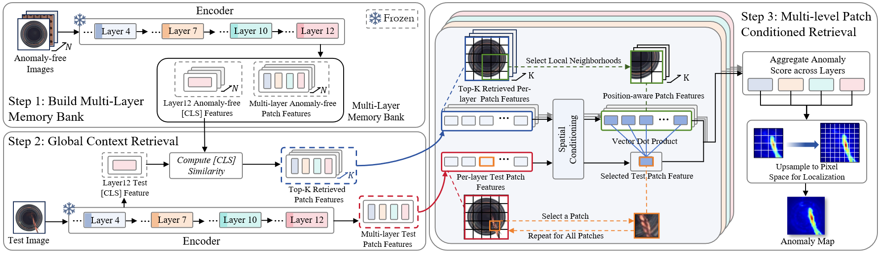

<h1 align="center">
🙋‍♂️Is Training Necessary for Anomaly Detction?</h1>

<p align = "center">

</p>


* **Official PyTorch implementation for paper:  "Is Training Necessary for Anomaly Detction?"** <br>

## 📰 Updates
- [2026/01/28] The code of RAD is released! 🎉

## 🗞️ Contents
- [Setup](#-setup)
- [Prepare Datasets](#-prepare-datasets)
- [Download pretrained Encoder](#-download-pretrained-encoder)
- [Multi-class Anomaly Detection](#-multi-class-Anomaly-Detection)

## 🛠️ Setup

First, clone this repository to your local machine, and install the dependencies.
```bash
conda create -n rad python=3.11 -y
conda activate rad
cd RAD
pip install -r requirements.txt
```
❗ You can modify the PyTorch version to suit your machine.
Experiments are conducted on an NVIDIA GeForce RTX 5090 (32GB). Same GPU and package version are recommended.

## 🗃️ Prepare Datasets
Noted that `../` is the upper directory of RAD code. It is where we keep all the datasets by default.
You can also alter it according to your need, just remember to modify the `data_path` in the code. 

### 📦 MVTec AD

Download the MVTec-AD dataset from [URL](https://www.mvtec.com/company/research/datasets/mvtec-ad).
Unzip the file to `../mvtec_anomaly_detection`.
```
|-- mvtec_anomaly_detection
    |-- bottle
    |-- cable
    |-- capsule
    |-- ....
```


### 🗂️ VisA

Download the VisA dataset from [URL](https://github.com/amazon-science/spot-diff).
Unzip the file to `../VisA/`. Preprocess the dataset to `../VisA_pytorch/` in 1-class mode by their official splitting 
[code](https://github.com/amazon-science/spot-diff).

You can also run the following command for preprocess, which is the same to their official code.

```
python ./prepare_data/prepare_visa.py --split-type 1cls --data-folder ../VisA --save-folder ../VisA_pytorch --split-file ./prepare_data/split_csv/1cls.csv
```
`../VisA_pytorch` will be like:
```
|-- VisA_pytorch
    |-- 1cls
        |-- candle
            |-- ground_truth
            |-- test
                    |-- good
                    |-- bad
            |-- train
                    |-- good
        |-- capsules
        |-- ....
```
 
### 📂 Real-IAD
Contact the authors of Real-IAD [URL](https://realiad4ad.github.io/Real-IAD/) to get the net disk link.

Download and unzip `realiad_1024` and `realiad_jsons` in `../Real-IAD`.
`../Real-IAD` will be like:
```
|-- Real-IAD
    |-- realiad_1024
        |-- audiokack
        |-- bottle_cap
        |-- ....
    |-- realiad_jsons
        |-- realiad_jsons
        |-- realiad_jsons_sv
        |-- realiad_jsons_fuiad_0.0
        |-- ....
```
### 📁 3D-ADAM
The 3D-ADAM dataset can be found publicly available in the [HuggingFace](https://huggingface.co/datasets/pmchard/3D-ADAM_anomalib) repository.

Ignore the **/xyz/** since we only use the RGB modality and download the dataset to `../3D-ADAM_anomalib`
```
python ./prepare_data/prepare_3dadam.py --data-folder ../3D-ADAM_anomalib --save-folder ../3D-ADAM
```
`../3D-ADAM` will be like:
```
|-- 3D-ADAM
    |-- 1m1
        |-- ground_truth
        |-- test
            |-- good
            |-- <defect_1>
            |-- <defect_2>
            |-- ...
        |-- train
            |-- good
    |-- 1m2
    |-- 1m3
    |-- 2m1
    |-- 2m2h
    |-- 2m2m
    |-- 3m1
    |-- ...
```

## ⬇️ Download pretrained Encoder

   - [`DINOv3 ViT-B/16`](https://ai.meta.com/resources/models-and-libraries/dinov3-downloads/): #parameters: 86M


## 🎮 Multi-class Anomaly Detection 

### MVTec AD
First build multi-layer anomaly-free memory bank.
```bash
python build_bank_multilayer.py \
    --data_path ../mvtec_anomaly_detection \
    --item_list carpet grid leather tile wood \
               bottle cable capsule hazelnut metal_nut \
               pill screw toothbrush transistor zipper \
    --encoder_name dinov3_vitb16 \
    --encoder_weight ../weights/dinov3_vitb16_pretrain_lvd1689m-73cec8be.pth \
    --image_size 512 \
    --crop_size 448 \
    --batch_size 32 \
    --num_workers 4 \
    --layer_idx_list 3 6 9 11 \
    --bank_path ./bank/mvtec_dinov3_vitb16_multilayer36911_448_bank.pth
```
- `data_path` is the folder dir that stores the datasets.
- `item_list` specifics the item classes of the datasets.
- `bank_path` is the folder dir that stores the bank.
- `layer_idx_list`  specifics the layer index (zero-based) of the encoder we extract features. 


Using RAD as a detecter.
```bash
python rad_mvtec_visa_3dadam.py \
    --data_path ../mvtec_anomaly_detection \
    --bank_path ./bank/mvtec_dinov3_vitb16_multilayer36911_448_bank.pth \
    --encoder_name dinov3_vitb16 \
    --encoder_weight ../weights/dinov3_vitb16_pretrain_lvd1689m-73cec8be.pth \
    --save_dir ./saved_results_mvtec \
    --save_name mvtec_patch_knn_multilayer_36911_448 \
    --k_image 150 \
    --resize_mask 256 \
    --max_ratio 0.01 \
    --vis_max 8 \
    --use_positional_bank \
    --pos_radius 1
    --item_list carpet grid leather tile wood \
               bottle cable capsule hazelnut metal_nut \
               pill screw toothbrush transistor zipper \
```
- `data_path` is the folder dir that stores the datasets.
- `save_dir` specifies the directory where logs, metrics, and visualization results are saved.
- `k_image` sets how many nearest-neighbor training images are used to build the local patch memory bank for each test image. 
- `resize_mask` sets the spatial resolution to which anomaly maps and ground-truth masks are resized for evaluation and visualization.
- `max_ratio` determines what fraction of the highest anomaly pixels are pooled to compute the image-level anomaly score.
- `vis_max` limits the maximum number of test samples that will be visualized per class.
- `use_positional_bank` enables the position-aware patch memory bank so that each patch only compares with patches from nearby spatial locations rather than all positions.
- `pos_radius` controls the spatial neighborhood radius (in patch units) used for the position-aware patch memory bank around each query patch.
- `item_list` specifics the item classes of the datasets.

### VisA
First build multi-layer anomaly-free memory bank.
```bash
python build_bank_multilayer.py \
    --data_path ../VisA_pytorch/1cls \
    --item_list candle capsules cashew chewinggum fryum \
               macaroni1 macaroni2 pcb1 pcb2 pcb3 pcb4 pipe_fryum \
    --encoder_name dinov3_vitb16 \
    --encoder_weight ../weights/dinov3_vitb16_pretrain_lvd1689m-73cec8be.pth \
    --image_size 512 \
    --crop_size 448 \
    --batch_size 32 \
    --num_workers 4 \
    --layer_idx_list 3 6 9 11 \
    --bank_path ./bank/visa_dinov3_vitb16_multilayer36911_448_bank.pth
```
- `data_path` is the folder dir that stores the datasets.
- `item_list` specifics the item classes of the datasets.
- `bank_path` is the folder dir that stores the bank.
- `layer_idx_list`  specifics the layer index (zero-based) of the encoder we extract features. 


Using RAD as a detecter.
```bash
python rad_mvtec_visa_3dadam.py \
    --data_path ../VisA_pytorch/1cls \
    --bank_path ./bank/visa_dinov3_vitb16_multilayer36911_448_bank.pth \
    --encoder_name dinov3_vitb16 \
    --encoder_weight ../weights/dinov3_vitb16_pretrain_lvd1689m-73cec8be.pth \
    --save_dir ./saved_results_patch_knn \
    --save_name visa_patch_knn_multilayer_36911_448 \
    --k_image 900 \
    --resize_mask 256 \
    --max_ratio 0.01 \
    --vis_max 8 \
    --use_positional_bank \
    --pos_radius 2
```
- `data_path` is the folder dir that stores the datasets.
- `save_dir` specifies the directory where logs, metrics, and visualization results are saved.
- `k_image` sets how many nearest-neighbor training images are used to build the local patch memory bank for each test image. 
- `resize_mask` sets the spatial resolution to which anomaly maps and ground-truth masks are resized for evaluation and visualization.
- `max_ratio` determines what fraction of the highest anomaly pixels are pooled to compute the image-level anomaly score.
- `vis_max` limits the maximum number of test samples that will be visualized per class.
- `use_positional_bank` enables the position-aware patch memory bank so that each patch only compares with patches from nearby spatial locations rather than all positions.
- `pos_radius` controls the spatial neighborhood radius (in patch units) used for the position-aware patch memory bank around each query patch.
- `item_list` specifics the item classes of the datasets.

### Real-IAD
First build multi-layer anomaly-free memory bank.
```bash
python build_realiad_bank_multilayer.py \
  --data_path ../Real-IAD \
  --encoder_name dinov3_vitb16 \
  --encoder_weight ../weights/dinov3_vitb16_pretrain_lvd1689m-73cec8be.pth \
  --image_size 512 \
  --crop_size 448 \
  --layer_idx_list 3 6 9 11 \
  --bank_path ./bank/realiad_dinov3_vitb16_multilayer36911_448_bank.pth
```
- `data_path` is the folder dir that stores the datasets.
- `bank_path` is the folder dir that stores the bank.
- `layer_idx_list`  specifics the layer index (zero-based) of the encoder we extract features. 


Using RAD as a detecter.
```bash
python rad_real_iad.py \
  --data_path ../Real-IAD \
  --bank_path ./bank/realiad_dinov3_vitb16_multilayer36911_448_bank.pth \
  --encoder_name dinov3_vitb16 \
  --encoder_weight ../weights/dinov3_vitb16_pretrain_lvd1689m-73cec8be.pth \
  --save_dir ./saved_results_realiad \
  --save_name realiad_multilayer_36911_448 \
  --k_image 900 \
  --resize_mask 256 \
  --max_ratio 0.01 \
  --vis_max 8 \
  --use_positional_bank \
  --pos_radius 0
```
- `data_path` is the folder dir that stores the datasets.
- `save_dir` specifies the directory where logs, metrics, and visualization results are saved.
- `k_image` sets how many nearest-neighbor training images are used to build the local patch memory bank for each test image. 
- `resize_mask` sets the spatial resolution to which anomaly maps and ground-truth masks are resized for evaluation and visualization.
- `max_ratio` determines what fraction of the highest anomaly pixels are pooled to compute the image-level anomaly score.
- `vis_max` limits the maximum number of test samples that will be visualized per class.
- `use_positional_bank` enables the position-aware patch memory bank so that each patch only compares with patches from nearby spatial locations rather than all positions.
- `pos_radius` controls the spatial neighborhood radius (in patch units) used for the position-aware patch memory bank around each query patch.

### 3D-ADAM
First build multi-layer anomaly-free memory bank.
```bash
python build_bank_multilayer.py \
    --data_path ../3D-ADAM \
--item_list 1m1 1m2 1m3 2m1 2m2h 2m2m \
           3m1 3m2 3m2c 4m1 4m2 4m2c \
           gripper_closed gripper_open helicalgear1 helicalgear2 \
           rackgear spiralgear spurgear tapa2m1 tapa3m1 tapa4m1 tapatbb \
    --encoder_name dinov3_vitb16 \
    --encoder_weight ../weights/dinov3_vitb16_pretrain_lvd1689m-73cec8be.pth \
    --image_size 512 \
    --crop_size 448 \
    --batch_size 32 \
    --num_workers 4 \
    --layer_idx_list 3 6 9 11 \
    --bank_path ./bank/3dadam_dinov3_vitb16_multilayer36911_448_bank.pth
```
- `data_path` is the folder dir that stores the datasets.
- `item_list` specifics the item classes of the datasets.
- `bank_path` is the folder dir that stores the bank.
- `layer_idx_list`  specifics the layer index (zero-based) of the encoder we extract features. 


Using RAD as a detecter.
```bash
python rad_mvtec_visa_3dadam.py \
    --data_path ../3D-ADAM \
    --bank_path ./bank/3dadam_dinov3_vitb16_multilayer36911_448_bank.pth \
    --encoder_name dinov3_vitb16 \
    --encoder_weight ../weights/dinov3_vitb16_pretrain_lvd1689m-73cec8be.pth \
    --save_dir ./saved_results_patch_knn \
    --save_name 3dadam_patch_knn_multilayer_36911_448 \
    --k_image 48 \
    --resize_mask 256 \
    --max_ratio 0.01 \
    --vis_max 8 \
    --use_positional_bank \
    --pos_radius 1
```
- `data_path` is the folder dir that stores the datasets.
- `save_dir` specifies the directory where logs, metrics, and visualization results are saved.
- `k_image` sets how many nearest-neighbor training images are used to build the local patch memory bank for each test image. 
- `resize_mask` sets the spatial resolution to which anomaly maps and ground-truth masks are resized for evaluation and visualization.
- `max_ratio` determines what fraction of the highest anomaly pixels are pooled to compute the image-level anomaly score.
- `vis_max` limits the maximum number of test samples that will be visualized per class.
- `use_positional_bank` enables the position-aware patch memory bank so that each patch only compares with patches from nearby spatial locations rather than all positions.
- `pos_radius` controls the spatial neighborhood radius (in patch units) used for the position-aware patch memory bank around each query patch.
- `item_list` specifics the item classes of the datasets.

## 🙏 Acknowledgement

This repository is built using the [Dinomaly](https://github.com/guojiajeremy/Dinomaly), the [DINOv3](https://github.com/facebookresearch/dinov3) and many other inspiring works in the community.


## 📄 License
This project is licensed under the license found in the LICENSE file in the root directory of this source tree.
[Microsoft Open Source Code of Conduct](https://opensource.microsoft.com/codeofconduct)